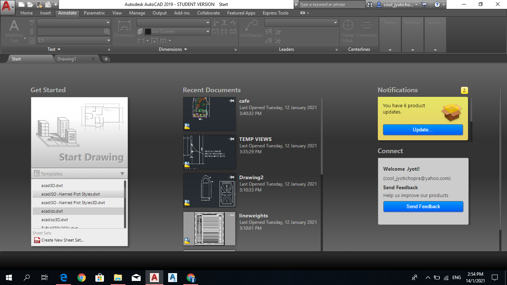
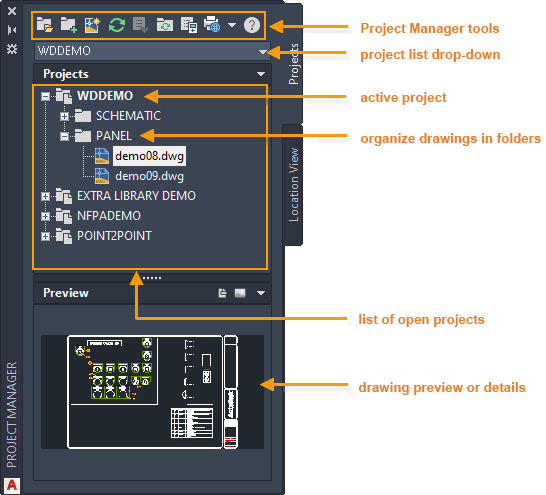
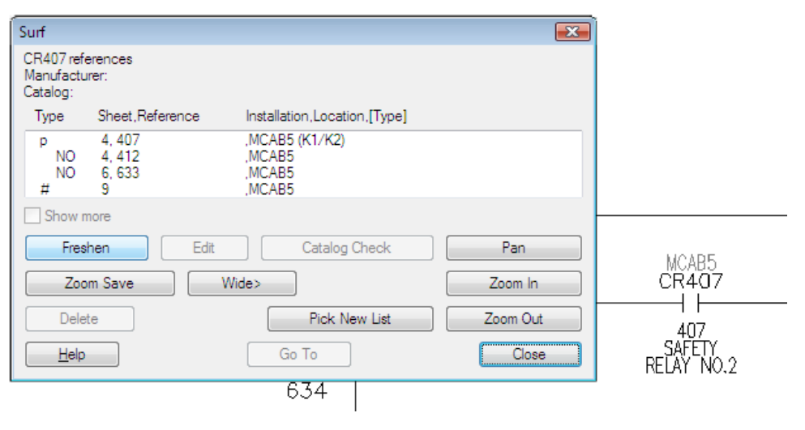
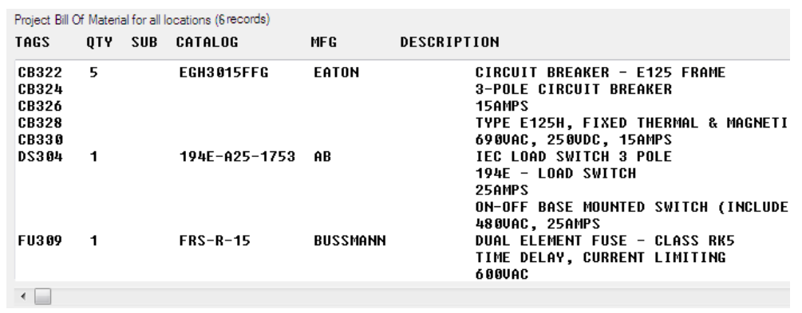
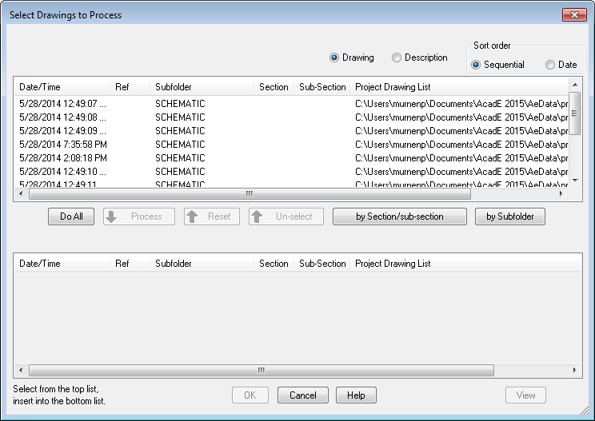

# Technical Drawing with AutoCAD Electrical — Learner Guide

**WSQ Course Code:** TGS-2023037466  |  **Conducted by:** Tertiary Infotech Academy Pte Ltd (UEN 201200696W)  |  **Version v6.0 · 18 August 2026**

## Contents

- [Introduction](#introduction)
- [Course Learning Outcomes](#course-learning-outcomes)
- [Skills Framework Coverage](#skills-framework-coverage)
- [Before You Start — Environment Setup](#before-you-start--environment-setup)
- [Topic 01 — Introduction to Technical Drawing Using AutoCAD Electrical](#topic-01--introduction-to-technical-drawing-using-autocad-electrical)
  - [Lab 1 — Set Up a New AutoCAD Electrical Drawing](#lab-1--set-up-a-new-autocad-electrical-drawing)
  - [Lab 2 — Create a Project with Project Manager](#lab-2--create-a-project-with-project-manager)
- [Topic 02 — Analysing Technical Drawings](#topic-02--analysing-technical-drawings)
  - [Lab 3 — Build Circuits with Circuit Builder](#lab-3--build-circuits-with-circuit-builder)
  - [Lab 4 — Insert Wires, Wire Numbers and Terminals](#lab-4--insert-wires-wire-numbers-and-terminals)
  - [Lab 5 — Cross-Reference and Surf a Drawing Set](#lab-5--cross-reference-and-surf-a-drawing-set)
- [Topic 03 — Reviewing Technical Drawings for Strategic Relevance and Standard Compliance](#topic-03--reviewing-technical-drawings-for-strategic-relevance-and-standard-compliance)
  - [Lab 6 — Create a Panel Layout with Footprints](#lab-6--create-a-panel-layout-with-footprints)
  - [Lab 7 — Generate Reports and Part Lists](#lab-7--generate-reports-and-part-lists)
  - [Lab 8 — Plot and Publish the Project to PDF](#lab-8--plot-and-publish-the-project-to-pdf)
- [Assessment Preparation](#assessment-preparation)
- [Glossary](#glossary)


## Introduction

This Learner Guide accompanies the WSQ course Technical Drawing with AutoCAD Electrical (TGS-2023037466), conducted by Tertiary Infotech Academy Pte Ltd. It provides step-by-step instructions for the 8 hands-on labs, organised by the three Learning Units of the accredited course. The course is mapped to the Skills Framework TSC Technical Drawing (DSN-TDR-4005-1.1), and the labs collectively cover every Ability statement (A1–A6) while the teaching topics cover every Knowledge statement (K1–K6).

Use this guide alongside the course slides and the lab folders in labs/ of the course repository. Each lab folder contains this guide's instructions as a PDF and Markdown file plus the starter DWG drawing files used in the lab.


## Course Learning Outcomes

- LO1: Devise metrics for technical drawings production using AutoCAD Electrical and formulate solutions for encountered development problems. (K1, K2, A1, A2)
- LO2: Analyse technical drawings with AutoCAD Electrical to determine construction needs while reviewing for accuracy and adherence to specifications. (K3, K4, A3, A4)
- LO3: Review technical drawings for relevance to organisation's strategies and ensure their conformance to submission standards. (K5, K6, A5, A6)


## Skills Framework Coverage

**Knowledge statements (assessed in the Written Assessment)**

- K1: Symbols, standards and conventions used in technical drawings across various fields and regions
- K2: Methods of technical drawing by instruments and computer-aided design (CAD) systems
- K3: Types of technical drawings
- K4: Technical drawing standards
- K5: Fundamentals of drafting design documentation
- K6: Concepts of information technology (IT) to facilitate the usage of technical drawing software

**Ability statements (assessed in the Practical Performance)**

- A1: Devise metrics and guidelines for the production of technical drawings
- A2: Formulate solutions for problems encountered during the development of technical drawings
- A3: Review technical drawings for accuracy and adherence to established specifications
- A4: Analyse drawings to determine their construction needs to deliver upon design solutions
- A5: Review technical drawings and/or changes to them, to ensure relevance to the organisation's strategies
- A6: Review drawings and specifications to ensure conformance to requirements of relevant standards for submission


## Before You Start — Environment Setup

**What you need**

- AutoCAD Electrical (the Electrical toolset included with AutoCAD) — download a free 30-day trial or use an education licence from autodesk.com.
- A Windows laptop meeting the Autodesk system requirements (the Electrical toolset is Windows-only; Mac users can run it via Parallels/Boot Camp or use a class machine).
- The lab starter files from the labs/ folder of the course repository — copy the whole labs/ folder to your machine.
- No prior AutoCAD experience is assumed, but basic computer operation skills are required.

**Launch and verify AutoCAD Electrical**

Start AutoCAD Electrical from the Windows Start menu (it appears as 'AutoCAD Electrical' or 'AutoCAD — Electrical toolset'). On first launch, confirm the ELECTRICAL workspace is active and that the Schematic, Panel and Reports ribbon tabs are visible.

```
Windows Start → AutoCAD Electrical 20xx
Workspace (status bar) → Electrical
Ribbon → confirm Schematic · Panel · Reports tabs
```

**Conventions used in every lab**

- Command names in CAPITALS (e.g. AEPROJECT) are typed at the command line; ribbon paths are given as Tab → Panel → Tool.
- Function keys: F7 grid · F8 ortho · F9 snap · F3 object snap.
- Each lab folder contains the starter DWG files; save your work into the same folder.
- Labs build on each other within a topic — complete them in order.


## Topic 01 — Introduction to Technical Drawing Using AutoCAD Electrical

User interface · symbols, standards & conventions · ribbon · navigation · projects & drawings  (K1, K2 · A1, A2)

**Key concepts**

- Symbols, standards, conventions — IEEE 315/315A, IEC-60617 and NFPA symbol libraries make an electrical drawing readable across fields and regions. (K1)
- CAD vs manual drawing — AutoCAD Electrical automates tagging, wire numbering and cross-referencing that instrument drawing does by hand. (K2)
- The AutoCAD Electrical UI — Ribbon tabs, Quick Access Toolbar, marking menu, palettes, status bar, command line and navigation tools.
- Projects drive everything — A .wdp project file groups interrelated drawings so project-wide functions can retag, renumber and report.
- Devise metrics & guidelines — Templates, drawing properties, reference systems and title blocks standardise production. (A1)
- Formulate solutions — Grid/snap, ortho, object snap and the Circuit Clipboard solve day-to-day drawing development problems. (A2)


### Lab 1 — Set Up a New AutoCAD Electrical Drawing

Objective: A1 — devise metrics and guidelines for technical drawing production (template, workspace, limits, units).

Goal: Create a new drawing from the ACADISO template, then set the workspace, drawing limits and units — the production metrics every drawing in your organisation should start from.

**What you'll build**

A correctly configured metric drawing sheet, saved as a reusable baseline for the rest of the course.   (Tools: AutoCAD Electrical · ACADISO template · Status bar · Grid & Snap.)



**Starter files (in the lab folder)**

- 1-0_Blank.dwg
- DraftingSettings.dwg

**Step-by-step**

1. Start AutoCAD Electrical and create a new drawing from the ACADISO template (New → acadiso.dwt).

   ```
   NEW  →  acadiso.dwt
   ```

2. Set the Electrical workspace from the Workspace Switching control on the status bar.

   ```
   WSCURRENT  →  Electrical
   ```

3. Set the drawing limits to an A3 metric sheet (0,0 to 420,297) and Zoom All to see the full sheet.

   ```
   LIMITS 0,0 420,297   then   ZOOM All
   ```

4. Set the units to decimal millimetres with 0 precision (Format → Units).

   ```
   UNITS  →  Decimal · 0
   ```

5. Turn on Grid (F7) and Snap (F9) from the status bar and open DraftingSettings.dwg to compare a pre-configured sheet.

   ```
   GRID 10   ·   SNAP 10
   ```

6. Save the drawing as MyBaseline.dwg — this is your production guideline drawing.

   ```
   SAVEAS MyBaseline.dwg
   ```


**Test it**

ZOOM All shows the full 420×297 sheet, the crosshair snaps in 10 mm increments, and STATUS reports decimal units — your baseline metrics are in force.

> **Note:** This lab's instructions and starter DWGs are in labs/lab-01-setting-up-a-new-drawing/.

---


### Lab 2 — Create a Project with Project Manager

Objective: A1, A2 — standardise production with a project; solve multi-drawing organisation problems.

Goal: AutoCAD Electrical is project-based: a .wdp project groups interrelated drawings so project-wide functions can retag and renumber. Create a project, add the supplied electrical plan drawings, and reorder them.

**What you'll build**

A working .wdp project containing the supplied power and lighting plan drawings plus a title block, in the correct sheet order.   (Tools: Project Manager · .wdp project file · Power_Plan / Lighting_Plan DWGs.)



**Starter files (in the lab folder)**

- 10-2_Power_Plan.dwg
- 10-2_Lighting_Plan.dwg
- Title_Block.dwg

**Step-by-step**

1. Open Project Manager from the Project tab (it is a palette — dock it on the left).

   ```
   AEPROJECT
   ```

2. Create a new project named TRAINING — the .wdp file stores the project description and settings.

   ```
   Project Manager → New Project → TRAINING
   ```

3. Review the Project Properties: library standard (IEC/IEEE/NFPA), component tag format and cross-reference style.

   ```
   Right-click project → Properties
   ```

4. Add the supplied drawings 10-2_Power_Plan.dwg and 10-2_Lighting_Plan.dwg to the project.

   ```
   Right-click project → Add Drawings
   ```

5. Drag and drop the drawings inside Project Manager so the power plan is sheet 1, and add Title_Block.dwg as reference-only.

   ```
   Drag to reorder · Properties → Reference Only
   ```

6. Make TRAINING the active project and open a drawing from the project list by double-clicking it.

   ```
   Right-click → Activate
   ```


**Test it**

Project Manager shows TRAINING in bold (active) with the drawings in your chosen order, and the .wdp file exists in the project folder — project-wide functions now see every sheet.

> **Note:** This lab's instructions and starter DWGs are in labs/lab-02-create-a-project-with-project-manager/.

---


## Topic 02 — Analysing Technical Drawings

Types of schematic drawings · components, terminals & PLC symbols · wires & part lists · accuracy review  (K3, K4 · A3, A4)

**Key concepts**

- Types of technical drawings — Schematics, panel layouts, wiring diagrams, one-line diagrams and reference-only sheets each serve a construction purpose. (K3)
- Technical drawing standards — Ladder references, X-Y grids, wire-number formats and cross-reference styles are the standards drawings are checked against. (K4)
- Schematic components — Insert from the icon menu or catalog database; annotate with tags, descriptions and catalog data.
- Terminals & PLC symbols — Standard part lists rely on terminal strips and parametric PLC I/O modules that adapt to the ladder.
- Wires, numbers & arrows — Wire layers, wire numbers and source/destination signal arrows carry the circuit across sheets.
- Review for accuracy — Cross-referencing, Surfer and Mark/Verify audit a drawing set for accuracy and adherence to specifications. (A3, A4)


### Lab 3 — Build Circuits with Circuit Builder

Objective: A4 — analyse drawings to determine construction needs; assemble standard motor-control circuits.

Goal: Use Circuit Builder to insert a three-phase motor-control circuit built dynamically from your selections, then save a frequently used circuit and re-insert it from the icon menu.

**What you'll build**

A schematic sheet containing a Circuit Builder motor circuit plus a saved, reusable circuit block.   (Tools: Circuit Builder · Icon Menu · Schematic components · Saved circuits.)


**Starter files (in the lab folder)**

- 2-0_Blank.dwg

**Step-by-step**

1. Open the supplied blank sheet 2-0_Blank.dwg inside your TRAINING project and insert a ladder to carry the circuit.

   ```
   AELADDER
   ```

2. Launch Circuit Builder from the Schematic tab and pick a 3-phase motor circuit from the tree.

   ```
   AECIRCBUILDER
   ```

3. Step through the Circuit Configuration dialog — select the disconnect, protection and control options; the circuit is built dynamically from your selections.

   ```
   Circuit Builder → Configure → Insert
   ```

4. Insert a push button and a selector switch from the Icon Menu to complete the control rung.

   ```
   AECOMPONENT  (Icon Menu)
   ```

5. Select the finished circuit and save it with Save Circuit to Icon Menu for reuse.

   ```
   Schematic → Circuit Clipboard → Save Circuit
   ```

6. Insert the saved circuit onto a clear area of the sheet and watch tags update to stay unique.

   ```
   Icon Menu → Saved Circuits
   ```


**Test it**

The motor circuit sits on the ladder with unique component tags (M1, PB1 …), and your saved circuit re-inserts with automatically retagged components — construction needs are met without redrawing.

> **Note:** This lab's instructions and starter DWGs are in labs/lab-03-build-circuits-with-circuit-builder/.

---


### Lab 4 — Insert Wires, Wire Numbers and Terminals

Objective: A3 — review drawings for accuracy; wire the circuit and number it to specification.

Goal: Insert wires between components, trim them, add automatic wire numbers in the drawing's specified format, and place schematic terminals — the accuracy checks every wiring diagram must pass.

**What you'll build**

A correctly wired and wire-numbered circuit with terminals, matching the drawing's wire-number specification.   (Tools: Wires · Wire Numbers · Trim Wire · Schematic Terminals · Power Plan DWG.)


**Starter files (in the lab folder)**

- 10-2_Power_Plan.dwg

**Step-by-step**

1. Continue on your Lab 3 sheet (keep 10-2_Power_Plan.dwg open as an analysis reference for wiring practice).

   ```
   OPEN 10-2_Power_Plan.dwg
   ```

2. Insert two vertical wires between two horizontal rungs — wires land on the wire layer automatically and tee-dots appear at junctions.

   ```
   AEWIRE
   ```

3. Trim the surplus wire segment with Trim Wire (the connected wires heal).

   ```
   AETRIM
   ```

4. Check the wire-number format on the Drawing Properties → Wire Numbers tab (this is the specification you are wiring to).

   ```
   AEPROPERTIES → Wire Numbers
   ```

5. Insert wire numbers project-wide and note that fixed wire numbers are skipped.

   ```
   AEWIRENO
   ```

6. Insert two schematic terminals from the Icon Menu (TRMS category) where the wires leave the sheet.

   ```
   AECOMPONENT → Terminals
   ```

7. Edit one wire number manually and mark it Fixed, then re-run wire numbering to confirm it is preserved.

   ```
   AEEDITWIRENO
   ```


**Test it**

Every wire carries a number in the drawing-property format, the fixed number survives a project-wide renumber, and the terminals join the wires cleanly — the sheet passes an accuracy review.

> **Note:** This lab's instructions and starter DWGs are in labs/lab-04-insert-wires-and-wire-numbers/.

---


### Lab 5 — Cross-Reference and Surf a Drawing Set

Objective: A3, A4 — review a multi-sheet set for accuracy with cross-references, Surfer and signal arrows.

Goal: Link a parent coil to its child contacts, break a wire across sheets with source/destination signal arrows, then audit the set with Surfer and Mark/Verify — how a checker reviews a real drawing set.

**What you'll build**

A cross-referenced two-sheet circuit you can navigate with Surfer, plus a Mark/Verify change report.   (Tools: Cross-referencing · Signal Arrows · Surfer · Mark/Verify · Reference DWG.)



**Starter files (in the lab folder)**

- 10-1_Working_with_References.dwg
- 10-2_HVAC_Plan.dwg

**Step-by-step**

1. Insert a relay coil (parent) on sheet 1 and a NO contact (child) on sheet 2 of your project; assign the child to the parent in the Insert/Edit Child dialog.

   ```
   AECOMPONENT → coil / contact
   ```

2. Update cross-references and read the parent's contact grid — it reports where every child lives.

   ```
   AEXREF
   ```

3. Break a wire network across the two sheets with a Source arrow (assign a code) and a matching Destination arrow.

   ```
   AESOURCE  ·  AEDEST
   ```

4. Right-click the coil and Surf: jump between the parent, children and signal arrows from the Surf list.

   ```
   AESURF
   ```

5. Mark the project (Mark/Verify), move one component, then run Verify to get the change report.

   ```
   AEMARKVERIFY
   ```

6. Open the supplied reference drawings and identify which sheets are reference-only in Project Manager.

   ```
   OPEN 10-1_Working_with_References.dwg
   ```


**Test it**

Surfer jumps coil → contact → signal arrow across sheets without manual searching, and the Verify report lists exactly the one component you moved — the set is auditable for accuracy.

> **Note:** This lab's instructions and starter DWGs are in labs/lab-05-cross-reference-and-surf/.

---


## Topic 03 — Reviewing Technical Drawings for Strategic Relevance and Standard Compliance

Drafting documentation · panel layouts · reports & part lists · custom symbols · plot & publish for submission  (K5, K6 · A5, A6)

**Key concepts**

- Fundamentals of documentation — Panel layouts, nameplates, item numbers and balloons turn a schematic into build documentation. (K5)
- Reports & part lists — BOM, wire from/to and component reports extract project data for checking and procurement.
- Custom symbols — Symbol Builder creates house-standard symbols so drawings match the organisation's conventions. (K6)
- Strategic relevance — Reuse projects, track changes and align drawing sets with the organisation's design strategies. (A5)
- Standard compliance — Title blocks, xrefs and plot standards keep sheets conformant to submission requirements. (A6)
- Plot & publish — Output the project to a printer or a hyperlinked multi-sheet PDF for stakeholder submission.


### Lab 6 — Create a Panel Layout with Footprints

Objective: A5 — turn the schematic into build documentation aligned with the organisation's design strategy.

Goal: Generate a panel layout from the schematic component list, insert footprints and a nameplate, and assign item numbers with balloons — drafting design documentation the workshop can build from.

**What you'll build**

A panel layout drawing with footprints placed from the schematic list, a nameplate, item numbers and balloons.   (Tools: Panel tab · Schematic List · Footprints · Nameplates · Item balloons · Blocks DWGs.)


**Starter files (in the lab folder)**

- 6-1_Working_with_Blocks.dwg
- 6-2_Working_with_Attributes.dwg

**Step-by-step**

1. Create a new panel drawing in your project and switch to the Panel tab of the ribbon.

   ```
   New Drawing → Panel tab
   ```

2. Insert footprints from the schematic list — AutoCAD Electrical matches each component's catalog value to a footprint.

   ```
   AEFOOTPRINT  (Schematic List)
   ```

3. Place the footprints inside the panel outline; values (tag, location, description) copy over from the schematic.

   ```
   Pick insertion points
   ```

4. Insert a nameplate from the Panel icon menu and associate it with a footprint.

   ```
   Panel Icon Menu → Nameplate
   ```

5. Assign item numbers project-wide — components with the same catalog value receive the same item number.

   ```
   AEPANELITEM
   ```

6. Add item balloons to the footprints and study the supplied blocks/attributes drawings to see how footprint blocks carry data.

   ```
   AEBALLOON
   ```


**Test it**

Each footprint shows the same tag as its schematic parent, the nameplate carries the footprint's description, and balloons display consistent item numbers — the panel documents the design faithfully.

> **Note:** This lab's instructions and starter DWGs are in labs/lab-06-create-a-panel-layout/.

---


### Lab 7 — Generate Reports and Part Lists

Objective: A6, K5 — extract BOM and wire lists, format them to house standards and place them on the drawing.

Goal: Run Bill of Material and Wire From/To reports across the project, tailor the fields, save a format file for repeat use, and insert the report as a table on the drawing — the part lists a checker reviews.

**What you'll build**

A BOM table placed on the drawing plus a saved .SET format file and a CSV export of the report.   (Tools: Reports · Bill of Material · Format files (.SET) · Tables · Attributes DWG.)



**Starter files (in the lab folder)**

- 5-1_Working_with_Tables.dwg
- 5-3_Using_Table_Links.dwg

**Step-by-step**

1. Run the Reports tool on the Reports tab and choose Bill of Material, processing the whole project.

   ```
   AEAUDIT →  Reports → BOM
   ```

2. Adjust the report: include/exclude fields, reorder columns and rename field labels to your house standard.

   ```
   Change Report Fields
   ```

3. Save the settings as a format file so the same report can be re-run in one click next time.

   ```
   Save Format File (.SET)
   ```

4. Insert the report on the drawing as a table (Put on Drawing) using a table style.

   ```
   Put on Drawing · TABLESTYLE
   ```

5. Export the same report to a file for procurement (CSV/XLS).

   ```
   Save to File → CSV
   ```

6. Run a Wire From/To report and compare it against the wiring you created in Lab 4; open the supplied table drawings to see linked tables.

   ```
   Reports → Wire From/To
   ```


**Test it**

The BOM table on the drawing matches the CSV export line for line, and re-running the report through your .SET format file reproduces the same layout — the part list is standard-compliant and repeatable.

> **Note:** This lab's instructions and starter DWGs are in labs/lab-07-generate-reports-and-part-lists/.

---


### Lab 8 — Plot and Publish the Project to PDF

Objective: A6 — output the drawing set to submission standards (A3 sheets, hyperlinked multi-sheet PDF).

Goal: Attach an external reference, then plot a drawing to an A3 PDF and publish the whole project to a single multi-sheet PDF with hyperlinks — the final conformance step before submission.

**What you'll build**

An A3 PDF plot of one sheet and a hyperlinked multi-sheet PDF of the whole project.   (Tools: External References · Plot · Publish · Multi-sheet PDF · Layout tabs DWG.)



**Starter files (in the lab folder)**

- 1-12_Using_Layout_Tabs.dwg
- New_Office_Layout.dwg

**Step-by-step**

1. Open the External References palette and attach a DWG as an xref to see how reference files are managed.

   ```
   XREF  →  Attach DWG
   ```

2. Open 1-12_Using_Layout_Tabs.dwg and review its layout tabs — plotting always happens from a layout with a page setup.

   ```
   OPEN → Layout tabs
   ```

3. Plot the active drawing to PDF at A3 size from the Plot dialog (printer: AutoCAD PDF, paper: ISO A3).

   ```
   PLOT → AutoCAD PDF → ISO A3
   ```

4. From Project Manager, choose Publish/Plot → Plot Project and select the sheets to output.

   ```
   Project Manager → Plot Project
   ```

5. Publish the project to a single multi-sheet PDF with Include Hyperlinks checked — cross-references become clickable links.

   ```
   AEPUBLISH → Multi-sheet · Hyperlinks
   ```

6. Open the PDF and click a parent's cross-reference to jump to its child; confirm the title block shows the plot date.

   ```
   Verify in PDF viewer
   ```


**Test it**

The A3 PDF matches the layout exactly, and in the multi-sheet PDF clicking a cross-reference hyperlink jumps to the referenced component — the set is ready for standards-conformant submission.

> **Note:** This lab's instructions and starter DWGs are in labs/lab-08-plot-and-publish-to-pdf/.

---


## Assessment Preparation

- The Written Assessment (SAQ) tests the Knowledge statements K1–K6 — review the Key Concepts of each topic and the symbol/standards material.
- The Practical Performance (PP) tests the Ability statements A1–A6 — redo each lab until you can complete it without referring to the steps.
- Both assessments are open book: bring the slides and this Learner Guide.
- Sharpen your readiness with the Tertiary Infotech practice exams: https://exams.tertiaryinfotech.com/
- Complete the TRAQOM survey and the Assessment digital attendance before sitting the assessment.


## Glossary

- **Project (.wdp)** — The AutoCAD Electrical project file grouping interrelated drawings with shared settings.
- **Project Manager** — The palette that creates, activates and manages projects and drawing order.
- **Ladder** — A schematic reference system of numbered rungs used to tag components and wires.
- **Icon menu** — The symbol picker that inserts schematic or panel symbols by type.
- **Catalog Browser** — The palette that inserts components by manufacturer part number from the catalog database.
- **Parent / child** — A multi-symbol device: the parent (e.g. relay coil) carries the tag; children (contacts) reference it.
- **Wire layer** — An AutoCAD layer designated to carry wires; wire networks live on wire layers.
- **Wire number** — The identifier assigned to a wire network in the drawing's specified format.
- **Signal arrow** — A source/destination pair that continues a wire network on another location or sheet.
- **Cross-reference** — Annotation linking parents, children and signal arrows to each other's locations.
- **Surfer** — The tool that jumps between cross-referenced components across the drawing set.
- **Footprint** — The panel-layout symbol representing a component's physical form.
- **Item number / balloon** — The BOM key assigned per catalog value, shown on the layout in a balloon.
- **Terminal Strip Editor** — The editor managing an entire terminal strip — order, catalog values, jumpers, spares.
- **Format file (.SET)** — Saved report settings that reproduce a house-standard report in one click.
- **Xref** — An external reference — a file attached into the current drawing without being copied in.
