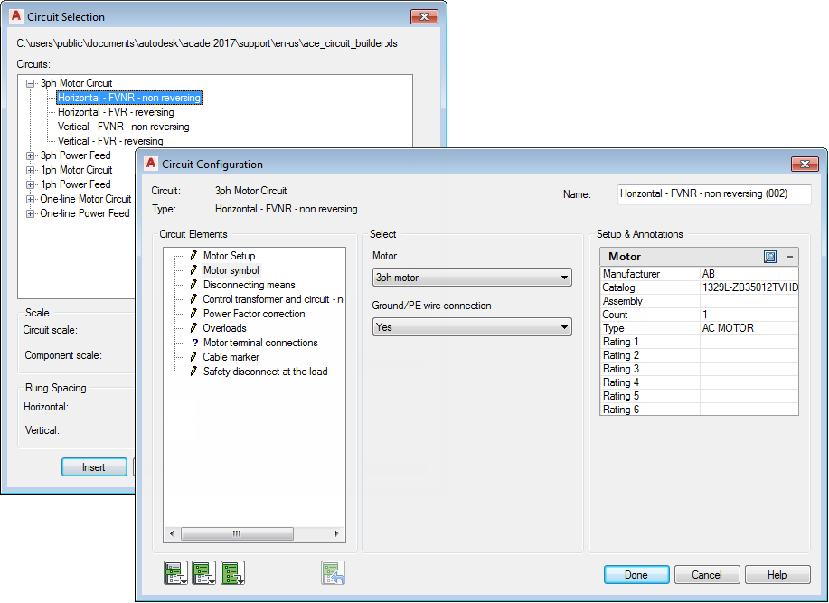

# Lab 3 — Build Circuits with Circuit Builder

**Course:** Technical Drawing with AutoCAD Electrical (TGS-2023037466)  ·  **Topic 02:** Analysing Technical Drawings
**Maps to:** A4 — analyse drawings to determine construction needs; assemble standard motor-control circuits

## Goal

Use Circuit Builder to insert a three-phase motor-control circuit built dynamically from your selections, then save a frequently used circuit and re-insert it from the icon menu.

## What you'll build

A schematic sheet containing a Circuit Builder motor circuit plus a saved, reusable circuit block.

**Tools:** Circuit Builder · Icon Menu · Schematic components · Saved circuits



## Starter files (in this folder)

- `2-0_Blank.dwg`  (source: [PacktPublishing/AutoCAD-2025-Best-Practices-Tips-and-Techniques](https://github.com/PacktPublishing/AutoCAD-2025-Best-Practices-Tips-and-Techniques))

## Step-by-step

1. Open the supplied blank sheet 2-0_Blank.dwg inside your TRAINING project and insert a ladder to carry the circuit.

   ```
   AELADDER
   ```

2. Launch Circuit Builder from the Schematic tab and pick a 3-phase motor circuit from the tree.

   ```
   AECIRCBUILDER
   ```

3. Step through the Circuit Configuration dialog — select the disconnect, protection and control options; the circuit is built dynamically from your selections.

   ```
   Circuit Builder → Configure → Insert
   ```

4. Insert a push button and a selector switch from the Icon Menu to complete the control rung.

   ```
   AECOMPONENT  (Icon Menu)
   ```

5. Select the finished circuit and save it with Save Circuit to Icon Menu for reuse.

   ```
   Schematic → Circuit Clipboard → Save Circuit
   ```

6. Insert the saved circuit onto a clear area of the sheet and watch tags update to stay unique.

   ```
   Icon Menu → Saved Circuits
   ```


## Test it

The motor circuit sits on the ladder with unique component tags (M1, PB1 …), and your saved circuit re-inserts with automatically retagged components — construction needs are met without redrawing.

---
*© 2026 Tertiary Infotech Academy Pte Ltd (UEN: 201200696W) · Technical Drawing with AutoCAD Electrical · Version v6.0*