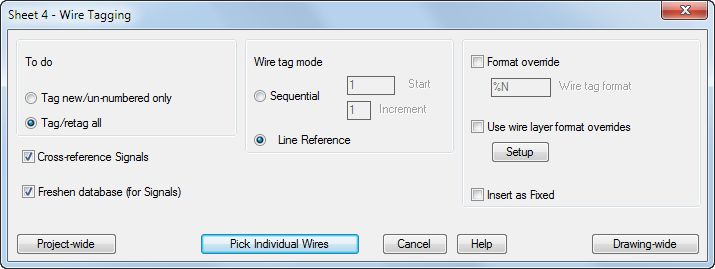

# Lab 4 — Insert Wires, Wire Numbers and Terminals

**Course:** Technical Drawing with AutoCAD Electrical (TGS-2023037466)  ·  **Topic 02:** Analysing Technical Drawings
**Maps to:** A3 — review drawings for accuracy; wire the circuit and number it to specification

## Goal

Insert wires between components, trim them, add automatic wire numbers in the drawing's specified format, and place schematic terminals — the accuracy checks every wiring diagram must pass.

## What you'll build

A correctly wired and wire-numbered circuit with terminals, matching the drawing's wire-number specification.

**Tools:** Wires · Wire Numbers · Trim Wire · Schematic Terminals · Power Plan DWG



## Starter files (in this folder)

- `10-2_Power_Plan.dwg`  (source: [PacktPublishing/AutoCAD-2025-Best-Practices-Tips-and-Techniques](https://github.com/PacktPublishing/AutoCAD-2025-Best-Practices-Tips-and-Techniques))
- `autodesk-electrical-sample-project/` — AutoCAD Electrical single-wire/component sample project (wddemo.wdp) (provided in the controlled course-delivery package; intentionally omitted from the public GitHub repository)

> **Compatibility safeguard:** Copy the complete package before opening it. These project files may contain legacy AutoCAD Electrical 2015 library paths. If prompted, allow the current Electrical toolset to update the copy, then remap missing NFPA/IEC or panel-library paths to the equivalent libraries installed with your current release. Never overwrite the supplied package.

## Step-by-step

1. Continue on your Lab 3 sheet. Open the Lab 4 sample-project copy and compare DEMO02/DEMO10 as AutoCAD Electrical-aware references; keep 10-2_Power_Plan.dwg open only as a conventional-plan comparison.

   ```
   AEPROJECT → Open Project → wddemo.wdp
   ```

2. Insert two vertical wires between two horizontal rungs — wires land on the wire layer automatically and tee-dots appear at junctions.

   ```
   AEWIRE
   ```

3. Trim the surplus wire segment with Trim Wire (the connected wires heal).

   ```
   AETRIM
   ```

4. Check the wire-number format on the Drawing Properties → Wire Numbers tab (this is the specification you are wiring to).

   ```
   AEPROPERTIES → Wire Numbers
   ```

5. Insert wire numbers project-wide and note that fixed wire numbers are skipped.

   ```
   AEWIRENO
   ```

6. Insert two schematic terminals from the Icon Menu (TRMS category) where the wires leave the sheet.

   ```
   AECOMPONENT → Terminals
   ```

7. Edit one wire number manually and mark it Fixed, then re-run wire numbering to confirm it is preserved.

   ```
   AEEDITWIRENO
   ```


## Test it

Every wire carries a number in the drawing-property format, the fixed number survives a project-wide renumber, and the terminals join the wires cleanly — the sheet passes an accuracy review.

---
*© 2026 Tertiary Infotech Academy Pte Ltd (UEN: 201200696W) · Technical Drawing with AutoCAD Electrical · Version v6.1*