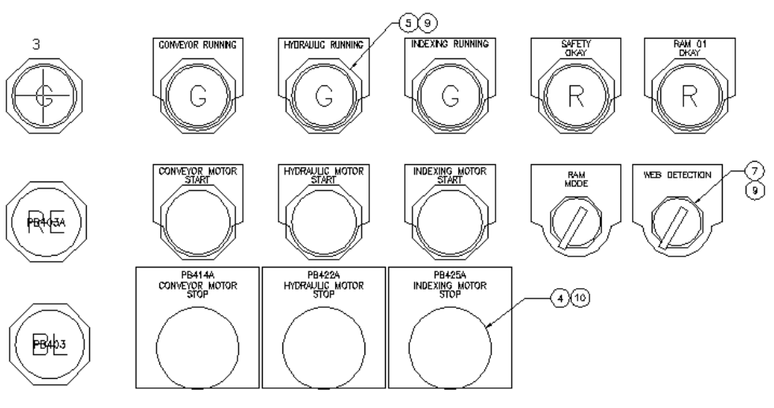

# Lab 6 — Create a Panel Layout with Footprints

**Course:** Technical Drawing with AutoCAD Electrical (TGS-2023037466)  ·  **Topic 03:** Reviewing Technical Drawings for Strategic Relevance and Standard Compliance
**Maps to:** A5 — turn the schematic into build documentation aligned with the organisation's design strategy

## Goal

Generate a panel layout from the schematic component list, insert footprints and a nameplate, and assign item numbers with balloons — drafting design documentation the workshop can build from.

## What you'll build

A panel layout drawing with footprints placed from the schematic list, a nameplate, item numbers and balloons.

**Tools:** Panel tab · Schematic List · Footprints · Nameplates · Item balloons · Blocks DWGs



## Starter files (in this folder)

- `6-1_Working_with_Blocks.dwg`  (source: [PacktPublishing/AutoCAD-2025-Best-Practices-Tips-and-Techniques](https://github.com/PacktPublishing/AutoCAD-2025-Best-Practices-Tips-and-Techniques))
- `6-2_Working_with_Attributes.dwg`  (source: [PacktPublishing/AutoCAD-2025-Best-Practices-Tips-and-Techniques](https://github.com/PacktPublishing/AutoCAD-2025-Best-Practices-Tips-and-Techniques))
- `autodesk-electrical-sample-project/` — AutoCAD Electrical schematic-and-panel sample project (wddemo.wdp) (provided in the controlled course-delivery package; intentionally omitted from the public GitHub repository)

> **Compatibility safeguard:** Copy the complete package before opening it. These project files may contain legacy AutoCAD Electrical 2015 library paths. If prompted, allow the current Electrical toolset to update the copy, then remap missing NFPA/IEC or panel-library paths to the equivalent libraries installed with your current release. Never overwrite the supplied package.

## Step-by-step

1. Open a working copy of the supplied `wddemo.wdp`; compare schematic DEMO01–DEMO07 with panel DEMO08–DEMO09 and confirm the project links are intact.

   ```
   AEPROJECT → Open Project → wddemo.wdp
   ```

2. Create a new panel drawing in your TRAINING project and switch to the Panel tab of the ribbon.

   ```
   New Drawing → Panel tab
   ```

3. Insert footprints from the schematic list — AutoCAD Electrical matches each component's catalog value to a footprint.

   ```
   AEFOOTPRINT  (Schematic List)
   ```

4. Place the footprints inside the panel outline; values (tag, location, description) copy over from the schematic.

   ```
   Pick insertion points
   ```

5. Insert a nameplate from the Panel icon menu and associate it with a footprint.

   ```
   Panel Icon Menu → Nameplate
   ```

6. Assign item numbers project-wide — components with the same catalog value receive the same item number.

   ```
   AEPANELITEM
   ```

7. Add item balloons to the footprints and study the supplied blocks/attributes drawings to see how footprint blocks carry data.

   ```
   AEBALLOON
   ```


## Test it

Each footprint shows the same tag as its schematic parent, the nameplate carries the footprint's description, and balloons display consistent item numbers — the panel documents the design faithfully.

---
*© 2026 Tertiary Infotech Academy Pte Ltd (UEN: 201200696W) · Technical Drawing with AutoCAD Electrical · Version v6.1*